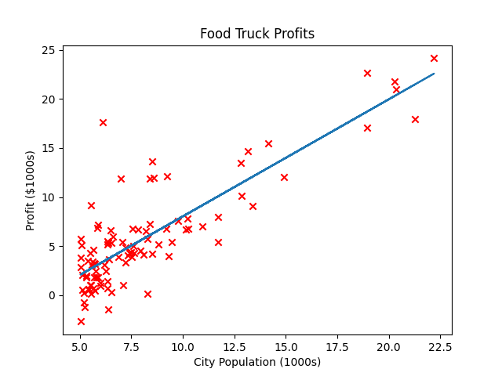
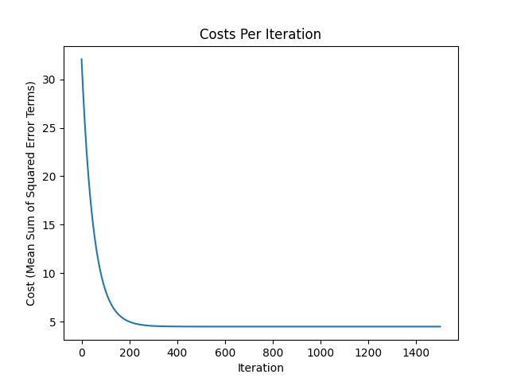
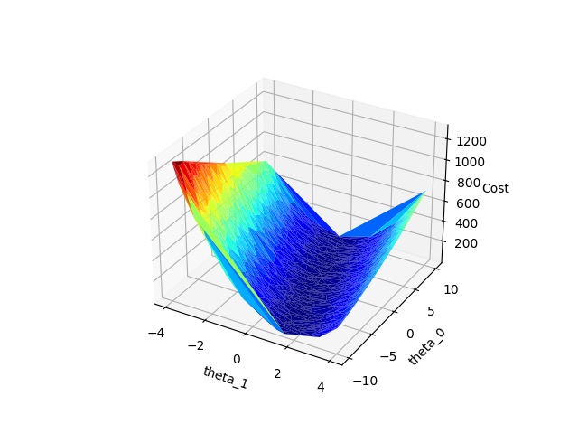

# Machine Learning
## Standford University
### Taught by Andrew Ng
---
[Course Info](https://www.coursera.org/learn/machine-learning-course/home/info)

## Terms
- Hypothesis Function ($h_{\theta}$)
    - the model function that is attempting to represnt some real world relationship(s)
- Cost Function ($J$)
    - The function to be minimized in a optimization problem
- Gradient Descent
    - One general algorithm for minimizing a cost function
$$\text{repeat until convergence } \lbrace \theta_j := \theta_j - \alpha \frac{\partial}{\partial \theta_j}J(\theta) \rbrace$$

$$\alpha =  \text{learning rate}$$

$$\frac{\partial}{\partial \theta_j}J(\theta) = \text{The partial derivative of J with respect to }\theta_j$$ 

## Linear Regression
### Hypothesis Function
$$Y  = h_{\theta}(X)= \theta_o + \theta_1X$$

### Cost Function
$$J(\theta_0, \theta_1) = \frac{1}{2n}\sum_{i=1}^n(\hat{Y}_i - Y_i)^2$$

### Gradient Descent
$$ \text{repeat until convergence } \lbrace 
    \\\\
    \theta_0 := \theta_0 - \alpha \frac{1}{m}\sum_{i=1}^m(h_{\theta}(x_i) - y_i)
    \\\\
    \theta_1 := \theta_1 - \alpha \frac{1}{m}\sum_{i=1}^m(h_{\theta}(x_i) - y_i)x_i
    \\\\
\rbrace$$
